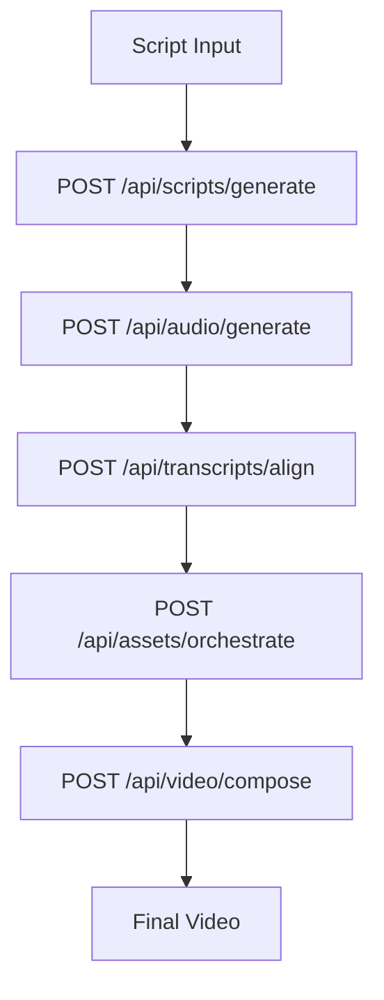
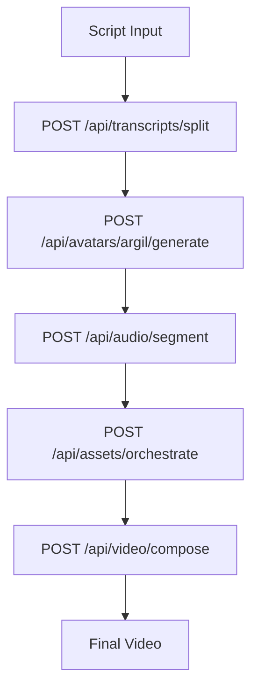
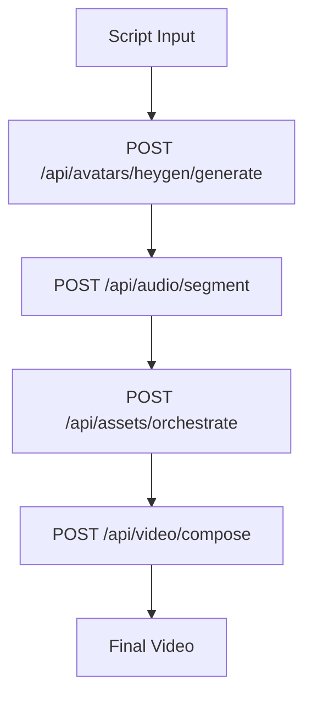
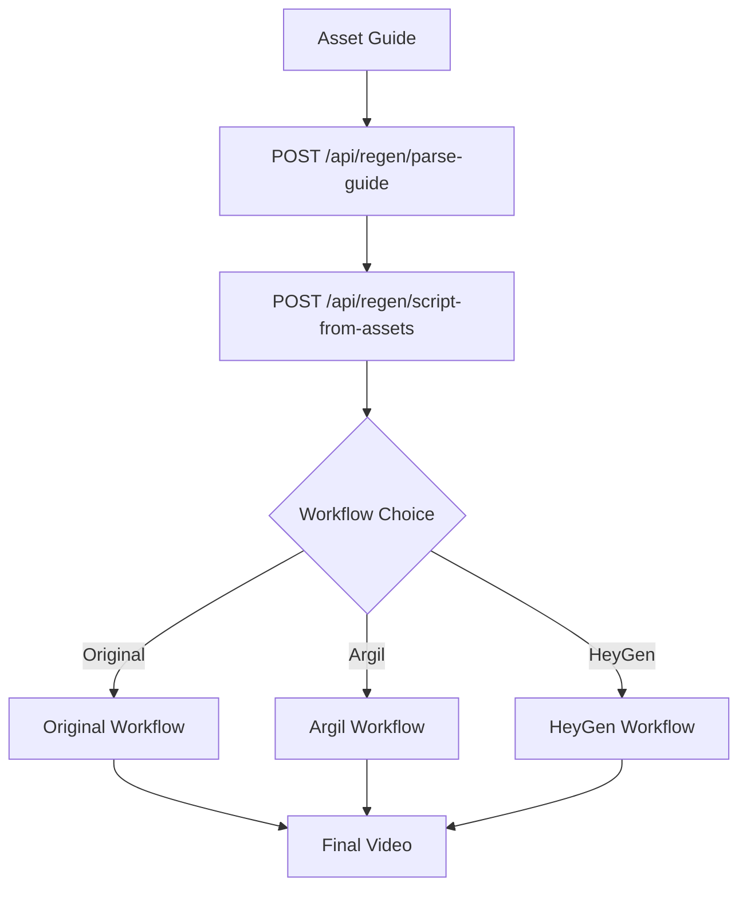

# Aidobe API Endpoint Plan - Complete Implementation Guide

## Overview

This document outlines the complete atomic endpoint architecture for aidobe, building upon the existing codebase while incorporating advanced features from wanx. Each endpoint is designed to be atomic, idempotent, and resumable for production-scale video generation.

## Current State Analysis

### ✅ Production-Ready Endpoints
- **Image Generation**: `POST /api/images/generate` - Well-implemented with multi-provider support
- **Job Management**: `POST /api/jobs/create`, `GET /api/jobs/:jobId` - Good foundation for orchestration
- **Basic Infrastructure**: Prompt enhancement, download management

### ⚠️ Endpoints Requiring Enhancement
- **Video Generation**: Currently basic prompt-to-video, needs workflow support
- **Script Generation**: Missing scene timing and avatar integration
- **Asset Discovery**: Limited to basic search, needs multi-source orchestration
- **Audio Processing**: No segmentation or lip-sync support

## Complete Atomic Endpoint Architecture

### 1. Avatar Generation System

#### Argil Avatar Generation
```typescript
POST /api/avatars/argil/generate
```
**Input Schema:**
```typescript
{
  transcript: string,
  avatarId: string,
  gesturePrompt?: string,
  voiceSettings?: {
    speed: number,
    stability: number,
    similarity: number
  }
}
```
**Output Schema:**
```typescript
{
  jobId: string,
  status: 'pending' | 'processing' | 'completed' | 'failed',
  avatarVideoUrl?: string,
  duration?: number,
  transcriptChunks?: Array<{
    text: string,
    startTime: number,
    endTime: number
  }>
}
```
**Idempotency:** Content hash of `transcript + avatarId + gesturePrompt`
**Prompts Used:** `argil_gesture_generation.md`
**Recovery:** Webhook polling with exponential backoff

#### HeyGen Avatar Generation
```typescript
POST /api/avatars/heygen/generate
```
**Input Schema:**
```typescript
{
  transcript: string,
  avatarId: string,
  voiceId: string,
  background?: string,
  settings?: {
    quality: 'draft' | 'standard' | 'high',
    ratio: '16:9' | '9:16' | '1:1'
  }
}
```
**Output Schema:**
```typescript
{
  jobId: string,
  status: 'pending' | 'processing' | 'completed' | 'failed',
  avatarVideoUrl?: string,
  duration?: number,
  thumbnailUrl?: string
}
```
**Idempotency:** Content hash of `transcript + avatarId + voiceId + background`
**Prompts Used:** `heygen_avatar_setup.md`
**Recovery:** Webhook polling with job state persistence

#### Avatar Configuration Management
```typescript
GET /api/avatars/config
PUT /api/avatars/config/:avatarId
```
**Purpose:** Manage avatar configurations, gestures, and voice mappings
**Idempotency:** Configuration versioning with rollback support

### 2. Transcript & Audio Segmentation System

#### Transcript Splitting Utility
```typescript
POST /api/transcripts/split
```
**Input Schema:**
```typescript
{
  transcript: string,
  maxChunkSize: number, // Default 250 for Argil API limits
  splitStrategy: 'sentence' | 'paragraph' | 'semantic' | 'time-based',
  preserveContext?: boolean
}
```
**Output Schema:**
```typescript
{
  chunks: Array<{
    text: string,
    startIndex: number,
    endIndex: number,
    wordCount: number,
    estimatedDuration: number
  }>,
  metadata: {
    totalChunks: number,
    averageChunkSize: number,
    splitStrategy: string
  }
}
```
**Idempotency:** Content hash of `transcript + maxChunkSize + splitStrategy`
**Prompts Used:** `transcript_semantic_splitting.md`
**Recovery:** Stateless operation, immediate response

#### Audio Segmentation for Lip-Sync
```typescript
POST /api/audio/segment
```
**Input Schema:**
```typescript
{
  audioUrl: string,
  transcriptChunks: Array<{
    text: string,
    startTime: number,
    endTime: number
  }>,
  segmentPurpose: 'avatar' | 'background' | 'effects',
  preserveQuality?: boolean
}
```
**Output Schema:**
```typescript
{
  segments: Array<{
    audioUrl: string,
    startTime: number,
    endTime: number,
    purpose: 'avatar' | 'background' | 'effects',
    quality: 'original' | 'compressed',
    fileSize: number
  }>,
  metadata: {
    totalSegments: number,
    totalDuration: number,
    compressionRatio?: number
  }
}
```
**Idempotency:** Content hash of `audioUrl + transcriptChunks + segmentPurpose`
**Prompts Used:** `audio_segmentation_strategy.md`
**Recovery:** Cached segmentation results in R2 storage

#### Word-Level Timestamp Alignment
```typescript
POST /api/transcripts/align
```
**Input Schema:**
```typescript
{
  audioUrl: string,
  transcript: string,
  language?: string,
  model?: 'whisper-1' | 'whisper-large' | 'groq-whisper'
}
```
**Output Schema:**
```typescript
{
  words: Array<{
    word: string,
    startTime: number,
    endTime: number,
    confidence: number,
    speaker?: string
  }>,
  metadata: {
    totalWords: number,
    averageConfidence: number,
    processingTime: number,
    model: string
  }
}
```
**Idempotency:** Content hash of `audioUrl + transcript + language`
**Prompts Used:** None (direct Whisper API integration)
**Recovery:** Cached transcription results with 30-day expiry

### 3. Enhanced Asset Orchestration System

#### Multi-Source Asset Search (Enhanced)
```typescript
POST /api/assets/search
```
**Input Schema:**
```typescript
{
  query: string,
  sources: Array<'pexels' | 'pixabay' | 'envato' | 'serp' | 'ai-generated' | 'local'>,
  filters: {
    duration?: number,
    orientation?: 'vertical' | 'horizontal' | 'square',
    quality?: 'hd' | '4k' | '8k',
    type?: 'video' | 'image' | 'audio',
    license?: 'free' | 'premium' | 'royalty-free'
  },
  maxResults?: number,
  qualityThreshold?: number
}
```
**Output Schema:**
```typescript
{
  results: Array<{
    url: string,
    source: string,
    quality: number,
    duration?: number,
    metadata: {
      title: string,
      description?: string,
      tags: string[],
      license: string,
      creator?: string
    },
    downloadUrl: string,
    thumbnailUrl: string
  }>,
  searchMetadata: {
    totalResults: number,
    searchTime: number,
    sourcesQueried: string[],
    qualityDistribution: Record<string, number>
  }
}
```
**Idempotency:** Content hash of `query + sources + filters + maxResults`
**Prompts Used:** `asset_evaluation_scoring.md`, `asset_quality_assessment.md`
**Recovery:** Cached search results with 24-hour expiry

#### Asset Orchestration Pipeline
```typescript
POST /api/assets/orchestrate
```
**Input Schema:**
```typescript
{
  scenes: Array<{
    sceneId: string,
    keywords: string[],
    duration: number,
    preferredSource?: string,
    fallbackSources?: string[],
    qualityRequirement?: 'minimum' | 'preferred' | 'maximum'
  }>,
  orchestrationStrategy: {
    fallbackBehavior: 'ai-generate' | 'stock-search' | 'local-assets' | 'error',
    parallelization: boolean,
    cacheResults: boolean,
    qualityOverSpeed: boolean
  }
}
```
**Output Schema:**
```typescript
{
  orchestratedAssets: Array<{
    sceneId: string,
    selectedAsset: {
      url: string,
      source: string,
      quality: number,
      selectionReason: string
    },
    fallbackAssets: Array<{
      url: string,
      source: string,
      quality: number
    }>,
    processingTime: number,
    cacheHit: boolean
  }>,
  orchestrationMetadata: {
    totalScenes: number,
    successfulOrchestrations: number,
    failedOrchestrations: number,
    averageQuality: number,
    totalProcessingTime: number
  }
}
```
**Idempotency:** Content hash of `scenes + orchestrationStrategy`
**Prompts Used:** `asset_orchestration_strategy.md`, `scene_asset_matching.md`
**Recovery:** Per-scene asset resolution with checkpoint system

### 4. Video Effects & Composition System

#### Ken Burns Effect Generation
```typescript
POST /api/video/effects/ken-burns
```
**Input Schema:**
```typescript
{
  imageUrl: string,
  duration: number,
  direction: 'zoom-in' | 'zoom-out' | 'pan-left' | 'pan-right' | 'auto',
  intensity: number, // 0.1 to 1.0
  easing: 'linear' | 'ease-in' | 'ease-out' | 'ease-in-out',
  startScale?: number,
  endScale?: number
}
```
**Output Schema:**
```typescript
{
  effectVideoUrl: string,
  duration: number,
  settings: {
    actualDirection: string,
    actualIntensity: number,
    startScale: number,
    endScale: number,
    easing: string
  },
  metadata: {
    inputResolution: string,
    outputResolution: string,
    processingTime: number,
    fileSize: number
  }
}
```
**Idempotency:** Content hash of `imageUrl + duration + direction + intensity + easing`
**Prompts Used:** `ken_burns_auto_direction.md`
**Recovery:** Cached effect generation with 7-day expiry

#### Text Overlay with Animations
```typescript
POST /api/video/effects/text-overlay
```
**Input Schema:**
```typescript
{
  text: string,
  duration: number,
  style: {
    animation: 'fade' | 'scale' | 'slide' | 'bounce' | 'typewriter',
    position: 'top' | 'middle' | 'bottom' | 'safe-zone',
    fontSize: number,
    fontColor: string,
    fontFamily?: string,
    backgroundColor?: string,
    padding?: number
  },
  timing: {
    fadeIn: number,
    display: number,
    fadeOut: number
  }
}
```
**Output Schema:**
```typescript
{
  overlayVideoUrl: string,
  duration: number,
  settings: {
    actualPosition: string,
    actualFontSize: number,
    boundingBox: {
      x: number,
      y: number,
      width: number,
      height: number
    }
  },
  metadata: {
    textLength: number,
    renderResolution: string,
    processingTime: number
  }
}
```
**Idempotency:** Content hash of `text + duration + style + timing`
**Prompts Used:** `text_overlay_positioning.md`
**Recovery:** Cached overlay generation with 7-day expiry

#### Video Composition Pipeline
```typescript
POST /api/video/compose
```
**Input Schema:**
```typescript
{
  layers: Array<{
    layerId: string,
    type: 'avatar' | 'background' | 'overlay' | 'text' | 'audio',
    url: string,
    startTime: number,
    endTime: number,
    position?: {
      x: number,
      y: number,
      width: number,
      height: number
    },
    effects?: Array<{
      type: 'fade' | 'scale' | 'rotate' | 'blur',
      parameters: Record<string, any>
    }>,
    zIndex: number,
    opacity?: number
  }>,
  outputFormat: {
    width: number,
    height: number,
    fps: number,
    format: 'mp4' | 'webm' | 'mov',
    quality: 'draft' | 'standard' | 'high' | 'ultra'
  },
  compositionSettings: {
    backgroundColor?: string,
    enableHardwareAcceleration?: boolean,
    optimizeForStreaming?: boolean
  }
}
```
**Output Schema:**
```typescript
{
  composedVideoUrl: string,
  duration: number,
  layers: Array<{
    layerId: string,
    processed: boolean,
    processingTime: number,
    errorMessage?: string
  }>,
  metadata: {
    totalLayers: number,
    finalResolution: string,
    fileSize: number,
    bitrate: number,
    totalProcessingTime: number
  }
}
```
**Idempotency:** Content hash of `layers + outputFormat + compositionSettings`
**Prompts Used:** `video_composition_optimization.md`
**Recovery:** Layer-by-layer composition with checkpoint system

### 5. Workflow Configuration System

#### Workflow Template Management
```typescript
GET /api/workflows/templates
POST /api/workflows/templates
PUT /api/workflows/templates/:templateId
DELETE /api/workflows/templates/:templateId
```
**POST Input Schema:**
```typescript
{
  name: string,
  description: string,
  workflow: {
    type: 'original' | 'argil' | 'heygen' | 'regen' | 'custom',
    steps: Array<{
      stepId: string,
      endpoint: string,
      parameters: Record<string, any>,
      dependencies?: string[],
      retryPolicy?: {
        maxRetries: number,
        backoffStrategy: 'linear' | 'exponential'
      }
    }>,
    defaultParameters: Record<string, any>,
    outputFormat: Record<string, any>
  },
  isDefault?: boolean,
  tags?: string[]
}
```
**Output Schema:**
```typescript
{
  templateId: string,
  name: string,
  workflow: WorkflowDefinition,
  version: number,
  isActive: boolean,
  createdAt: string,
  updatedAt: string
}
```
**Idempotency:** Template versioning with rollback support
**Prompts Used:** `workflow_validation.md`
**Recovery:** Template versioning system with diff tracking

#### Prompt Template Management
```typescript
GET /api/prompts/templates
POST /api/prompts/templates
PUT /api/prompts/templates/:templateId
DELETE /api/prompts/templates/:templateId
```
**POST Input Schema:**
```typescript
{
  name: string,
  description: string,
  template: string, // Jinja2 template string
  variables: Array<{
    name: string,
    type: 'string' | 'number' | 'boolean' | 'array' | 'object',
    required: boolean,
    default?: any,
    description?: string,
    validation?: {
      pattern?: string,
      min?: number,
      max?: number,
      enum?: any[]
    }
  }>,
  category: 'script' | 'asset' | 'avatar' | 'effects' | 'orchestration',
  version?: string,
  tags?: string[]
}
```
**Output Schema:**
```typescript
{
  templateId: string,
  name: string,
  template: string,
  variables: Array<TemplateVariable>,
  category: string,
  version: string,
  isCompiled: boolean,
  compilationErrors?: string[],
  createdAt: string,
  updatedAt: string
}
```
**Idempotency:** Content hash of `template + variables + category`
**Prompts Used:** None (manages prompts themselves)
**Recovery:** Template versioning with A/B testing support

### 6. #REGEN Workflow System

#### Asset Guide Parsing
```typescript
POST /api/regen/parse-guide
```
**Input Schema:**
```typescript
{
  assetGuide: string,
  parsingOptions: {
    preserveOrder: boolean,
    extractMetadata: boolean,
    validateAssets: boolean,
    allowDuplicates: boolean
  },
  format: 'text' | 'markdown' | 'structured' | 'auto-detect'
}
```
**Output Schema:**
```typescript
{
  parsedAssets: Array<{
    order: number,
    type: 'standard' | 'user-uploaded' | 'search-keywords' | 'ai-generated',
    content: string,
    metadata?: {
      estimatedDuration?: number,
      quality?: string,
      keywords?: string[],
      source?: string
    },
    validation?: {
      isValid: boolean,
      errors?: string[]
    }
  }>,
  parsingMetadata: {
    totalAssets: number,
    typeDistribution: Record<string, number>,
    parsingTime: number,
    validationErrors: string[]
  }
}
```
**Idempotency:** Content hash of `assetGuide + parsingOptions + format`
**Prompts Used:** `asset_guide_parsing.md`, `asset_validation.md`
**Recovery:** Stateless parsing with caching

#### Script Regeneration from Assets
```typescript
POST /api/regen/script-from-assets
```
**Input Schema:**
```typescript
{
  parsedAssets: Array<ParsedAsset>,
  regenerationOptions: {
    originalScript?: string,
    targetDuration: number,
    tone: string,
    preserveStructure: boolean,
    maintainTiming: boolean
  },
  outputFormat: {
    includeTimestamps: boolean,
    includeSceneBreaks: boolean,
    includeAssetCues: boolean
  }
}
```
**Output Schema:**
```typescript
{
  regeneratedScript: string,
  scenes: Array<{
    sceneId: string,
    text: string,
    startTime: number,
    endTime: number,
    assetCues: string[],
    originalAssetOrder?: number
  }>,
  timing: {
    totalDuration: number,
    averageSceneDuration: number,
    timingAccuracy: number
  },
  metadata: {
    totalScenes: number,
    wordsChanged: number,
    structurePreserved: boolean,
    regenerationTime: number
  }
}
```
**Idempotency:** Content hash of `parsedAssets + regenerationOptions + outputFormat`
**Prompts Used:** `script_regeneration.md`, `scene_timing_optimization.md`
**Recovery:** Scene-by-scene regeneration with checkpoint system

## Workflow Data Flow Diagrams

### Original Workflow


### Argil Workflow


### HeyGen Workflow


### #REGEN Workflow


## Implementation Priority

### Phase 1: Core Avatar Integration (Weeks 1-2)
1. **Transcript Splitting Utility** - Essential for all avatar workflows
2. **Argil Avatar Generation** - Primary avatar provider
3. **Audio Segmentation** - Enables lip-sync functionality
4. **Enhanced Job Management** - Webhook processing for async operations

### Phase 2: Asset Orchestration (Weeks 3-4)
1. **Multi-Source Asset Search** - Enhanced existing endpoint
2. **Asset Orchestration Pipeline** - Intelligent asset selection
3. **Video Effects System** - Ken Burns and text overlays
4. **Basic Video Composition** - Layer-based assembly

### Phase 3: Advanced Features (Weeks 5-6)
1. **HeyGen Avatar Integration** - Secondary avatar provider
2. **#REGEN Workflow System** - Asset guide processing
3. **Workflow Configuration** - Template management
4. **Prompt Template System** - Dynamic prompt management

### Phase 4: Production Features (Weeks 7-8)
1. **Advanced Video Composition** - Professional effects
2. **Performance Optimization** - Caching and scaling
3. **Comprehensive Testing** - Unit, integration, and E2E tests
4. **Documentation and Deployment** - Production readiness

## Testing Strategy

### Unit Tests
- **Service Layer**: Each service method tested in isolation
- **Endpoint Handlers**: Input validation, error handling, response formatting
- **Utilities**: Transcript splitting, audio segmentation, asset orchestration
- **Prompt Templates**: Template compilation, variable substitution

### Integration Tests
- **Workflow Execution**: End-to-end workflow testing
- **Provider Integration**: External API integration testing
- **Database Operations**: Data persistence and retrieval
- **Cache Performance**: Caching effectiveness and invalidation

### End-to-End Tests
- **Complete Video Generation**: Full workflow execution
- **Error Recovery**: Failure scenarios and recovery
- **Performance**: Load testing and scalability
- **User Experience**: Frontend integration testing

## Success Metrics

### Technical Metrics
- **Endpoint Response Time**: <2s for synchronous operations
- **Video Generation Time**: <5 minutes for standard videos
- **Error Rate**: <1% for all operations
- **Cache Hit Rate**: >80% for repeated operations

### Business Metrics
- **Workflow Completion Rate**: >95% success rate
- **User Satisfaction**: Quality of generated videos
- **Cost Efficiency**: Optimization of AI provider usage
- **Scalability**: Support for concurrent operations

This comprehensive endpoint plan provides a solid foundation for transforming aidobe into a production-ready video generation platform while maintaining the atomic, idempotent principles essential for reliable orchestration.