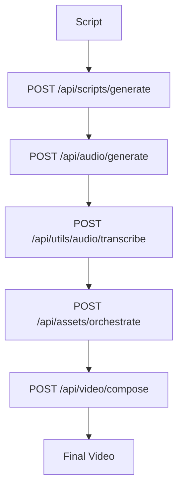
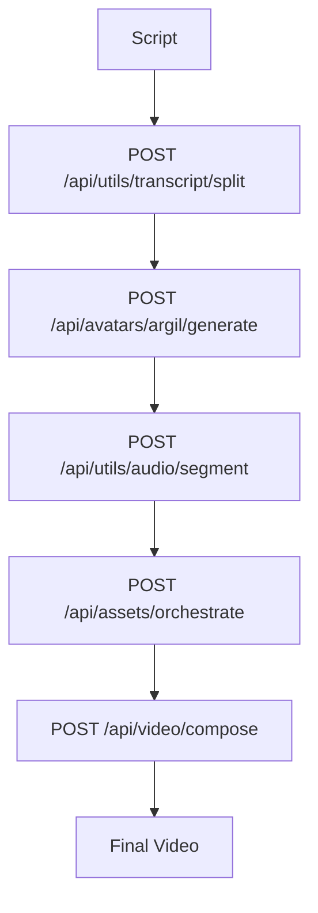

# Focused Atomic API Endpoint Plan for aidobe

## Executive Summary

This document outlines the **complete set of atomic, idempotent API endpoints** needed to port wanx functionality to aidobe. Each endpoint performs one specific operation and can be resumed/recovered, making REGEN workflows inherently supported without specific endpoints.

## Core Principles

1. **Atomic Operations**: Each endpoint does one thing well
2. **Idempotent Design**: Same input always produces same output
3. **Resumable Workflows**: Any workflow can be paused and resumed
4. **Inherent REGEN**: Because endpoints are atomic, any workflow can be reconstructed from asset guides

## Current State vs Required

### ✅ Already Implemented (Production Ready)
- `POST /api/images/generate` - Multi-provider image generation
- `POST /api/jobs/create` - Job management and tracking
- `GET /api/jobs/:jobId` - Job status and progress
- `POST /api/prompts/enhance` - Prompt enhancement

### ⚠️ Needs Enhancement
- `POST /api/videos/generate` - Currently basic, needs workflow support
- `POST /api/scripts/generate` - Missing scene timing and avatar support
- `POST /api/assets/search` - Missing multi-source orchestration
- `POST /api/audio/generate` - Missing segmentation and lip-sync

## Complete Atomic Endpoint Set

### 1. Core Utility Endpoints (New)

#### Transcript Splitting
```typescript
POST /api/utils/transcript/split
Input: {
  transcript: string,
  maxChunkSize: number, // 250 for Argil limits
  splitStrategy: 'sentence' | 'semantic' | 'time-based'
}
Output: {
  chunks: Array<{text: string, startIndex: number, endIndex: number}>
}
Idempotency: Content hash of transcript + maxChunkSize
Prompts: transcript_semantic_splitting.md
```

#### Audio Segmentation
```typescript
POST /api/utils/audio/segment
Input: {
  audioUrl: string,
  segments: Array<{startTime: number, endTime: number, purpose: string}>
}
Output: {
  segmentedAudio: Array<{audioUrl: string, startTime: number, endTime: number}>
}
Idempotency: Content hash of audioUrl + segments
Prompts: N/A (FFmpeg processing)
```

#### Timestamp Alignment (Local Whisper)
```typescript
POST /api/utils/audio/transcribe
Input: {
  audioUrl: string,
  transcript?: string,
  language?: string
}
Output: {
  words: Array<{word: string, startTime: number, endTime: number, confidence: number}>,
  sentences: Array<{text: string, startTime: number, endTime: number}>,
  fullText: string
}
Idempotency: Content hash of audioUrl
Prompts: N/A (Local Whisper processing)
Recovery: Cached transcription results with file hash verification
```

### 2. Avatar Generation (New - Critical)

#### Argil Avatar Generation
```typescript
POST /api/avatars/argil/generate
Input: {
  transcript: string,
  avatarId: string,
  gesturePrompt?: string,
  voiceSettings?: {speed: number, stability: number}
}
Output: {
  jobId: string,
  status: 'pending' | 'processing' | 'completed' | 'failed',
  avatarVideoUrl?: string,
  duration?: number
}
Idempotency: Content hash of transcript + avatarId + gesturePrompt
Prompts: argil_gesture_generation.md
Recovery: Webhook polling with exponential backoff
```

#### Avatar Configuration
```typescript
GET /api/avatars/config
PUT /api/avatars/config/:avatarId
```

### 3. Enhanced Asset Orchestration (Enhance Existing)

#### Multi-Source Asset Search
```typescript
POST /api/assets/search
Input: {
  query: string,
  sources: Array<'pexels' | 'pixabay' | 'envato' | 'ai-generated'>,
  filters: {duration?: number, orientation?: string, quality?: string}
}
Output: {
  results: Array<{url: string, source: string, quality: number, metadata: any}>
}
Idempotency: Content hash of query + sources + filters
Prompts: asset_evaluation_scoring.md
```

#### Asset Orchestration
```typescript
POST /api/assets/orchestrate
Input: {
  scenes: Array<{sceneId: string, keywords: string[], duration: number}>,
  fallbackStrategy: 'ai-generate' | 'stock-search' | 'local-assets'
}
Output: {
  orchestratedAssets: Array<{sceneId: string, selectedAsset: Asset, fallbackAssets: Asset[]}>
}
Idempotency: Content hash of scenes + fallbackStrategy
Prompts: asset_orchestration_strategy.md
```

### 4. Video Effects & Composition (New)

#### Ken Burns Effects
```typescript
POST /api/video/effects/ken-burns
Input: {
  imageUrl: string,
  duration: number,
  direction: 'zoom-in' | 'zoom-out' | 'pan-left' | 'pan-right' | 'auto',
  intensity: number
}
Output: {
  effectVideoUrl: string,
  settings: KenBurnsSettings
}
Idempotency: Content hash of imageUrl + duration + direction + intensity
Prompts: ken_burns_auto_direction.md
```

#### Text Overlays
```typescript
POST /api/video/effects/text-overlay
Input: {
  text: string,
  duration: number,
  style: {animation: string, position: string, fontSize: number, color: string}
}
Output: {
  overlayVideoUrl: string,
  settings: TextOverlaySettings
}
Idempotency: Content hash of text + duration + style
Prompts: text_overlay_positioning.md
```

#### Video Composition
```typescript
POST /api/video/compose
Input: {
  layers: Array<{type: string, url: string, startTime: number, endTime: number, zIndex: number}>,
  outputFormat: {width: number, height: number, fps: number}
}
Output: {
  composedVideoUrl: string,
  duration: number,
  metadata: CompositionMetadata
}
Idempotency: Content hash of layers + outputFormat
Prompts: video_composition_optimization.md
```

### 5. Configuration Management (New)

#### Prompt Templates
```typescript
GET /api/prompts/templates
POST /api/prompts/templates
PUT /api/prompts/templates/:templateId
Input: {
  name: string,
  template: string, // Jinja2 template
  variables: Array<{name: string, type: string, default: any}>,
  category: 'script' | 'asset' | 'avatar' | 'effects'
}
Output: {
  templateId: string,
  compiled: boolean,
  variables: Array<Variable>
}
Idempotency: Content hash of template + variables
```

#### Workflow Templates
```typescript
GET /api/workflows/templates
POST /api/workflows/templates
PUT /api/workflows/templates/:templateId
Input: {
  name: string,
  workflow: {
    type: 'original' | 'argil' | 'custom',
    steps: Array<{stepId: string, endpoint: string, parameters: any}>
  }
}
Output: {
  templateId: string,
  workflow: WorkflowDefinition
}
Idempotency: Template versioning
```

## Workflow Examples

### Original Workflow (Script → TTS → Video)


### Argil Avatar Workflow


### Inherent REGEN Workflow
```mermaid
graph TD
    A[Asset Guide] --> B[Parse & Extract]
    B --> C{Determine Workflow}
    C -->|Original| D[Original Workflow]
    C -->|Argil| E[Argil Workflow]
    D --> F[Final Video]
    E --> F
    
    Note: No specific REGEN endpoints needed
    Asset guides can trigger any workflow
```

## Implementation Priority

### Week 1-2: Core Utilities
1. **Transcript Splitting Utility** (`src/utils/transcript-splitter.ts`)
2. **Audio Segmentation Service** (`src/utils/audio-segmentation.ts`)
3. **Enhanced Job Management** (webhook processing)

### Week 3-4: Avatar Integration
1. **Argil Avatar Service** (`src/services/ai/argil.ts`)
2. **Avatar Handler** (`src/handlers/avatars.ts`)
3. **Avatar Configuration Management**

### Week 5-6: Asset Orchestration
1. **Multi-Source Asset Search** (enhance existing)
2. **Asset Orchestration Service** (`src/services/assets/orchestrator.ts`)
3. **Provider Integrations** (Pexels, Pixabay, Envato)

### Week 7-8: Video Effects & Configuration
1. **Ken Burns Effects Service** (`src/services/media/effects.ts`)
2. **Video Composition Service** (`src/services/media/composition.ts`)
3. **Prompt Template Management** (`src/services/prompt-templates.ts`)

## Testing Strategy

### Unit Tests (Required for Each Endpoint)
```typescript
// Example for transcript splitting
describe('TranscriptSplitter', () => {
  it('should split transcript into chunks under 250 characters', () => {
    const splitter = new TranscriptSplitter();
    const result = splitter.split('long transcript...', 250);
    expect(result.chunks.every(chunk => chunk.text.length <= 250)).toBe(true);
  });
  
  it('should be idempotent for same input', () => {
    const splitter = new TranscriptSplitter();
    const result1 = splitter.split('test', 250);
    const result2 = splitter.split('test', 250);
    expect(result1).toEqual(result2);
  });
});
```

### Integration Tests (Required for Each Workflow)
```typescript
// Example for Argil workflow
describe('Argil Avatar Workflow', () => {
  it('should complete full workflow from script to video', async () => {
    const script = 'Hello, this is a test script';
    
    // Step 1: Split transcript
    const chunks = await splitTranscript(script, 250);
    
    // Step 2: Generate avatar
    const avatar = await generateArgilAvatar(chunks[0].text, 'avatar-1');
    
    // Step 3: Orchestrate assets
    const assets = await orchestrateAssets([{keywords: ['test'], duration: 10}]);
    
    // Step 4: Compose video
    const finalVideo = await composeVideo([avatar, ...assets]);
    
    expect(finalVideo.url).toBeDefined();
  });
});
```

### Atomicity Tests (Critical)
```typescript
// Test that each endpoint is truly atomic and idempotent
describe('Endpoint Atomicity', () => {
  it('should produce same result for same input', async () => {
    const input = {transcript: 'test', avatarId: 'avatar-1'};
    const result1 = await POST('/api/avatars/argil/generate', input);
    const result2 = await POST('/api/avatars/argil/generate', input);
    
    expect(result1.avatarVideoUrl).toBe(result2.avatarVideoUrl);
  });
  
  it('should be resumable after interruption', async () => {
    const jobId = await startLongRunningJob();
    
    // Simulate interruption
    await interruptJob(jobId);
    
    // Resume should continue from where it left off
    const result = await resumeJob(jobId);
    expect(result.status).toBe('completed');
  });
});
```

## Success Metrics

### Technical Metrics
- **Endpoint Response Time**: <2s for synchronous operations
- **Idempotency Rate**: 100% for same inputs
- **Job Recovery Rate**: >99% for interrupted jobs
- **Test Coverage**: >95% for all endpoints

### Business Metrics
- **Workflow Completion Rate**: >95%
- **Avatar Generation Success**: >90%
- **Asset Resolution Success**: >85%
- **Video Composition Success**: >95%

## Key Benefits of This Design

1. **Inherent REGEN**: No special endpoints needed - any workflow can be reconstructed
2. **Atomic Operations**: Each endpoint does one thing well
3. **Resumable Workflows**: Jobs can be paused and resumed at any step
4. **Flexible Orchestration**: External systems can easily compose workflows
5. **Comprehensive Testing**: Each endpoint can be tested in isolation

This focused plan provides exactly what's needed to port wanx functionality while maintaining the clean, atomic design principles that make aidobe production-ready.