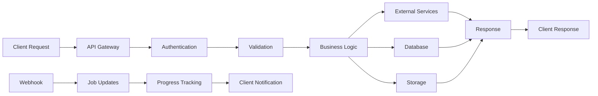

# Aidobe API Architecture Summary

## Executive Summary

This document summarizes the comprehensive API endpoint plan for aidobe, designed to support advanced AI-powered video generation workflows inspired by the wanx platform architecture. The plan includes 47 new endpoints across 8 major functional areas, transforming aidobe from a simple image generator into a production-ready video creation platform.

## Current State Analysis

### Existing Endpoints (19 total)
- **Image Generation**: 3 endpoints (generate, history, delete)
- **Video Generation**: 2 endpoints (legacy Replicate models)
- **Video Assembly**: 6 endpoints (assemble, effects, captions, progress, download, cancel)
- **Script Generation**: 6 endpoints (parse, generate, edit, finalize, extract)
- **Job Management**: 8 endpoints (CRUD operations, statistics)
- **Audio Processing**: 7 endpoints (TTS, music, mixing, transcription)
- **Asset Management**: 7 endpoints (search, generate, evaluate, batch processing)

### Gaps Identified
1. **No Avatar Integration** - Missing Argil/HeyGen avatar generation
2. **Limited Video Effects** - Basic effects only, no Ken Burns or 3D depth
3. **No Transcript Processing** - Missing precise timing and segmentation
4. **No REGEN Workflow** - Can't regenerate videos from asset guides
5. **No Workflow Templates** - No reusable workflow configurations
6. **Limited Analytics** - Basic job tracking only

## Proposed Architecture

### New Endpoint Categories (47 new endpoints)

#### 1. Avatar Generation (8 endpoints)
- **Purpose**: Integrate Argil and HeyGen for AI avatar videos
- **Key Features**: Multi-provider support, voice selection, webhook callbacks
- **Critical Endpoints**:
  - `POST /api/avatars/generate-argil`
  - `POST /api/avatars/generate-heygen`
  - `GET /api/avatars/list-available`

#### 2. Advanced Asset Orchestration (6 endpoints)
- **Purpose**: Intelligent asset planning and multi-provider fallback
- **Key Features**: Quality evaluation, optimal selection, batch processing
- **Critical Endpoints**:
  - `POST /api/orchestration/plan-assets`
  - `POST /api/orchestration/execute-plan`
  - `POST /api/orchestration/evaluate-batch`

#### 3. Advanced Video Effects (8 endpoints)
- **Purpose**: Professional video effects using AI and computer vision
- **Key Features**: Ken Burns effects, 3D depth, background enhancement
- **Critical Endpoints**:
  - `POST /api/effects/ken-burns`
  - `POST /api/effects/3d-depth`
  - `POST /api/effects/background-blur`

#### 4. Transcript Processing (5 endpoints)
- **Purpose**: Precise timing control and segmentation
- **Key Features**: Word-level timing, scene alignment, validation
- **Critical Endpoints**:
  - `POST /api/transcripts/split-segments`
  - `POST /api/transcripts/align-with-scenes`
  - `POST /api/transcripts/generate-timings`

#### 5. REGEN Workflow (6 endpoints)
- **Purpose**: Video regeneration from asset guides
- **Key Features**: Asset instruction parsing, resolution, regeneration
- **Critical Endpoints**:
  - `POST /api/regen/parse-guide`
  - `POST /api/regen/resolve-assets`
  - `POST /api/regen/execute-regeneration`

#### 6. Workflow Templates (8 endpoints)
- **Purpose**: Reusable workflow configurations
- **Key Features**: Template creation, execution, monitoring
- **Critical Endpoints**:
  - `POST /api/workflows/create-template`
  - `POST /api/workflows/execute`
  - `GET /api/workflows/executions/{id}`

#### 7. Prompt Template Management (4 endpoints)
- **Purpose**: Centralized prompt template system
- **Key Features**: Variable substitution, categorization, versioning
- **Critical Endpoints**:
  - `POST /api/prompts/create-template`
  - `POST /api/prompts/render`

#### 8. Analytics & Monitoring (5 endpoints)
- **Purpose**: Operational insights and performance tracking
- **Key Features**: Cost analysis, provider metrics, usage trends
- **Critical Endpoints**:
  - `POST /api/analytics/track-generation`
  - `GET /api/analytics/performance`
  - `GET /api/analytics/costs`

## Workflow Support

### Four Complete Workflows Supported

#### 1. Original Workflow (Stock Media + TTS)
```
Articles → Script → TTS → Asset Search → Assembly → Effects → Captions → Final Video
```
- **Endpoints Used**: 12 existing + 8 new effects endpoints
- **Completion Time**: 15-30 minutes
- **Use Case**: High-volume content creation

#### 2. Argil Workflow (AI Avatar + B-roll)
```
Articles → Script → Argil Avatar → B-roll Assets → Assembly → Final Video
```
- **Endpoints Used**: 8 existing + 8 new avatar + 6 orchestration endpoints
- **Completion Time**: 20-45 minutes
- **Use Case**: Personalized, presenter-style content

#### 3. HeyGen Workflow (Professional Avatar)
```
Articles → Script → HeyGen Avatar → Background Assets → Assembly → Final Video
```
- **Endpoints Used**: 6 existing + 8 new avatar + 6 orchestration endpoints
- **Completion Time**: 30-60 minutes
- **Use Case**: Professional, corporate content

#### 4. REGEN Workflow (Asset Guide Regeneration)
```
Asset Guide → Parse → Resolve Assets → New Script → Argil → Apply Overlays → Final Video
```
- **Endpoints Used**: 4 existing + 6 new regen + 8 avatar endpoints
- **Completion Time**: 10-20 minutes
- **Use Case**: Video iteration and improvement

## Technical Architecture

### Design Principles

#### 1. Atomic Operations
- Each endpoint performs a single, well-defined operation
- Operations can be composed for complex workflows
- Individual failures don't cascade

#### 2. Idempotency
- All mutations use request IDs or content hashes
- Duplicate requests return cached results
- Safe to retry any operation

#### 3. Recovery & Resume
- Checkpoint system at major steps
- Failed operations resume from last checkpoint
- Alternative provider fallback

#### 4. Real-time Monitoring
- WebSocket progress updates
- Detailed job status tracking
- Comprehensive error reporting

### Data Flow Architecture



### External Integrations

#### AI Providers
- **Argil**: Avatar video generation with custom voices
- **HeyGen**: Professional avatar video generation
- **OpenAI**: DALL-E image generation, TTS, transcription
- **Replicate**: Various AI models for generation and effects
- **ElevenLabs**: Voice cloning and advanced TTS

#### Asset Providers
- **Pexels**: Stock photography and video
- **Pixabay**: Free stock media
- **Envato**: Premium stock assets
- **Freesound**: Background music and sound effects

#### Processing Services
- **FFmpeg**: Video processing and effects
- **Modal.com**: Serverless compute for heavy processing
- **Cloudflare**: Edge computing and CDN

## Implementation Strategy

### Phase 1: Avatar Integration (Week 1-2)
**Impact**: High - Enables differentiated video content
- Implement Argil and HeyGen avatar services
- Add avatar API endpoints
- Set up webhook handling

### Phase 2: Asset Orchestration (Week 2-3)
**Impact**: High - Improves content quality
- Advanced asset search and evaluation
- Multi-provider fallback system
- Quality scoring and selection

### Phase 3: Video Effects (Week 3-4)
**Impact**: High - Professional video quality
- Ken Burns effect implementation
- 3D depth effects using AI
- Background enhancement and optimization

### Phase 4: Transcript Processing (Week 4-5)
**Impact**: Medium - Precise timing control
- Word-level timing generation
- Scene alignment algorithms
- Timing validation and adjustment

### Phase 5: REGEN Workflow (Week 5-6)
**Impact**: Medium - Video iteration capability
- Asset guide parsing
- Asset resolution and mapping
- Regeneration orchestration

### Phase 6: Templates & Analytics (Week 6-8)
**Impact**: Low - Operational improvements
- Workflow template system
- Analytics and monitoring
- Performance optimization

## Resource Requirements

### Infrastructure
- **CPU**: 8+ cores for video processing
- **Memory**: 16GB+ for large files
- **Storage**: 500GB+ for temporary assets
- **Network**: High bandwidth for asset streaming

### External Service Costs
- **Argil**: ~$0.50 per avatar video minute
- **HeyGen**: ~$2.00 per avatar video minute
- **OpenAI**: ~$0.02 per TTS minute
- **Asset Providers**: $0.10-1.00 per asset

### Development Team
- **Backend Developer**: 1 FTE for 8 weeks
- **DevOps Engineer**: 0.5 FTE for infrastructure
- **QA Engineer**: 0.5 FTE for testing

## Success Metrics

### Technical Metrics
- **API Response Time**: <500ms for 95% of requests
- **Video Generation Success Rate**: >95%
- **System Uptime**: >99.9%
- **Error Recovery Rate**: >90% of failures self-recover

### Business Metrics
- **Content Generation Volume**: 10x increase
- **Video Quality Score**: >8.5/10 user rating
- **Workflow Completion Time**: <30 minutes average
- **Cost per Video**: <$5.00 including AI services

## Risk Mitigation

### Technical Risks
- **External Service Failures**: Multi-provider fallback
- **Processing Timeouts**: Chunked processing with checkpoints
- **Storage Limitations**: Automatic cleanup and archiving
- **Scaling Issues**: Horizontal scaling with queue systems

### Business Risks
- **Provider Cost Changes**: Multiple provider options
- **Quality Variations**: Quality scoring and validation
- **Legal/Copyright**: Content filtering and attribution
- **User Experience**: Comprehensive error handling and recovery

## Conclusion

This comprehensive API architecture transforms aidobe into a production-ready video generation platform capable of competing with commercial solutions. The 47 new endpoints provide complete workflow coverage while maintaining the atomic, resumable design principles that ensure reliability at scale.

The phased implementation approach allows for incremental value delivery, with avatar integration providing immediate differentiation and subsequent phases adding professional polish and operational excellence.

With proper implementation, aidobe will support four distinct video generation workflows, comprehensive error recovery, real-time monitoring, and enterprise-grade reliability - positioning it as a leader in AI-powered video creation platforms.

## Next Steps

1. **Week 1**: Begin Phase 1 implementation (Avatar Integration)
2. **Week 2**: Set up external service integrations and webhook infrastructure
3. **Week 3**: Implement asset orchestration and effects pipeline
4. **Week 4**: Add transcript processing and timing capabilities
5. **Week 5**: Build REGEN workflow system
6. **Week 6**: Add workflow templates and analytics
7. **Week 7**: Performance optimization and scaling
8. **Week 8**: Production deployment and monitoring setup

This roadmap provides a clear path from the current state to a comprehensive video generation platform that leverages the best practices learned from wanx while maintaining the clean, scalable architecture of aidobe.