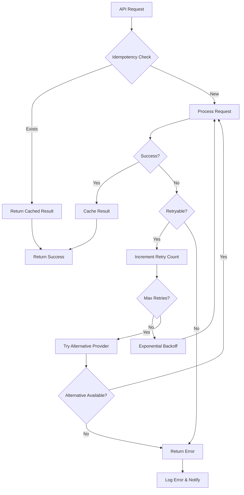
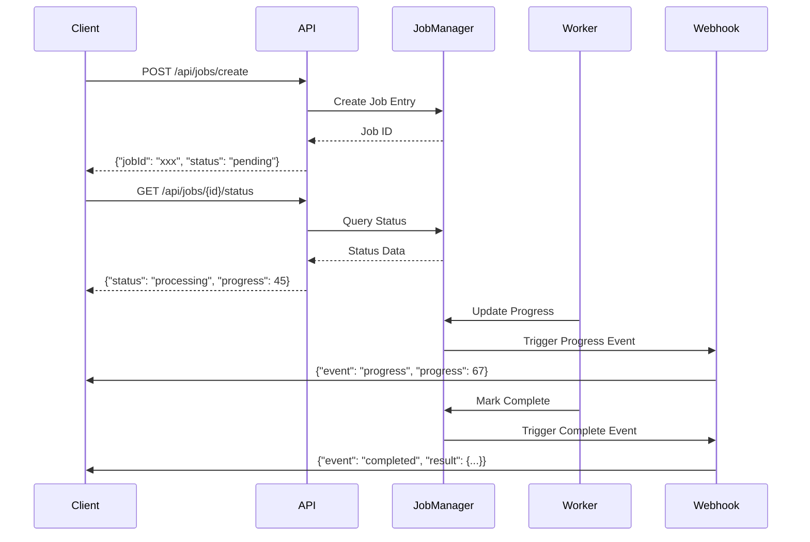
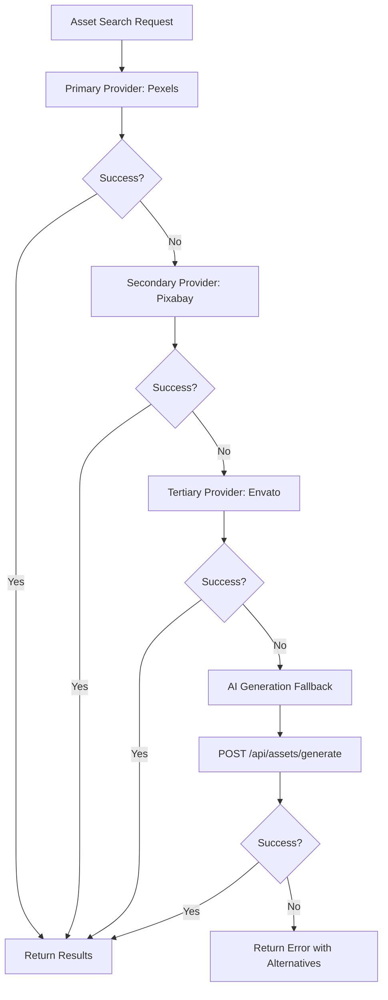
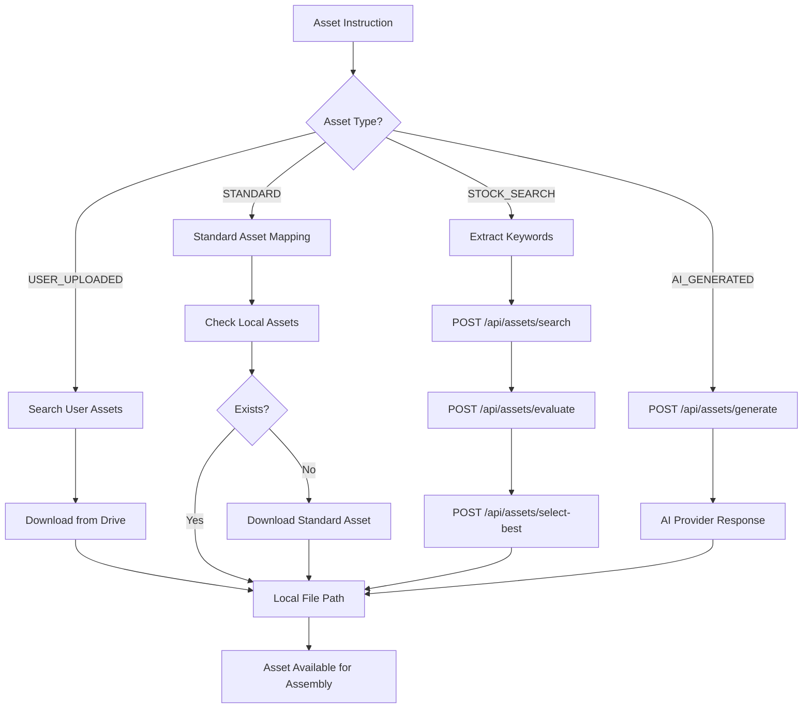

# Aidobe Workflow Data Flow Diagrams

## 1. Original Workflow (Stock Media + TTS)

```mermaid
graph TD
    A[Input Articles] --> B[POST /api/scripts/parse-articles]
    B --> C[Article Data + Keywords]
    C --> D[POST /api/scripts/generate-structured]
    D --> E[Structured Script + Scene Plan]
    
    E --> F[POST /api/audio/generate-tts]
    F --> G[TTS Audio Files]
    
    E --> H[POST /api/assets/batch-process]
    H --> I[Asset Discovery Results]
    
    E --> J[POST /api/audio/search-music]
    J --> K[Background Music]
    
    G --> L[POST /api/audio/mix]
    K --> L
    L --> M[Mixed Audio Track]
    
    I --> N[POST /api/video/assemble]
    M --> N
    N --> O[Raw Video Assembly]
    
    O --> P[POST /api/video/apply-effects]
    P --> Q[Video with Ken Burns Effects]
    
    Q --> R[POST /api/video/add-captions]
    R --> S[Final Video with Captions]
    
    S --> T[POST /api/jobs/{jobId} - Mark Complete]
```

## 2. Argil Workflow (AI Avatar + B-roll)

```mermaid
graph TD
    A[Input Articles] --> B[POST /api/scripts/parse-articles]
    B --> C[Article Data]
    C --> D[POST /api/scripts/generate-structured]
    D --> E[Script with Avatar Segments]
    
    E --> F[POST /api/avatars/generate-argil]
    F --> G[Argil Avatar Videos]
    
    E --> H[POST /api/assets/search - B-roll only]
    H --> I[B-roll Assets]
    
    E --> J[POST /api/audio/search-music]
    J --> K[Background Music]
    
    G --> L[POST /api/video/assemble]
    I --> L
    K --> L
    L --> M[Raw Video Assembly]
    
    M --> N[POST /api/video/apply-effects]
    N --> O[Video with Effects]
    
    O --> P[POST /api/video/add-captions]
    P --> Q[Final Avatar Video]
    
    Q --> R[POST /api/jobs/{jobId} - Mark Complete]
```

## 3. HeyGen Workflow (Professional Avatar)

```mermaid
graph TD
    A[Input Articles] --> B[POST /api/scripts/parse-articles]
    B --> C[Article Data]
    C --> D[POST /api/scripts/generate-structured]
    D --> E[Full Script Text]
    
    E --> F[POST /api/avatars/generate-heygen]
    F --> G[HeyGen Webhook Response]
    G --> H[Avatar Video URL]
    
    E --> I[POST /api/assets/search - Background only]
    I --> J[Background Assets]
    
    E --> K[POST /api/audio/search-music]
    K --> L[Background Music]
    
    H --> M[POST /api/video/assemble]
    J --> M
    L --> M
    M --> N[Composite Video]
    
    N --> O[POST /api/video/apply-effects]
    O --> P[Enhanced Video]
    
    P --> Q[POST /api/jobs/{jobId} - Mark Complete]
```

## 4. REGEN Workflow (Asset Guide Regeneration)

```mermaid
graph TD
    A[Asset Guide Text] --> B[POST /api/regen/parse-guide]
    B --> C[Parsed Overlays]
    
    C --> D[POST /api/regen/resolve-assets]
    D --> E[Resolved Asset Paths]
    
    C --> F[Extract Script Text]
    F --> G[POST /api/avatars/generate-argil]
    G --> H[New Argil Video]
    
    E --> I[Download User Assets]
    E --> J[Search Stock Assets]
    
    H --> K[POST /api/video/assemble]
    I --> K
    J --> K
    K --> L[Base Video with Overlays]
    
    L --> M[POST /api/video/apply-effects]
    M --> N[POST /api/video/add-captions]
    N --> O[Final Regenerated Video]
    
    O --> P[POST /api/jobs/{jobId} - Mark Complete]
```

## 5. Endpoint Orchestration Flow

```mermaid
graph LR
    subgraph "Job Management"
        A[POST /api/jobs/create]
        B[GET /api/jobs/{id}/status]
        C[PATCH /api/jobs/{id}]
    end
    
    subgraph "Content Generation"
        D[POST /api/scripts/parse-articles]
        E[POST /api/scripts/generate-structured]
        F[POST /api/prompts/render]
    end
    
    subgraph "Audio Processing"
        G[POST /api/audio/generate-tts]
        H[POST /api/audio/search-music]
        I[POST /api/audio/mix]
        J[POST /api/audio/transcribe]
    end
    
    subgraph "Avatar Generation"
        K[POST /api/avatars/generate-argil]
        L[POST /api/avatars/generate-heygen]
        M[GET /api/avatars/list-available]
    end
    
    subgraph "Asset Management"
        N[POST /api/assets/search]
        O[POST /api/assets/evaluate]
        P[POST /api/assets/select-best]
        Q[POST /api/orchestration/plan-assets]
    end
    
    subgraph "Video Processing"
        R[POST /api/video/assemble]
        S[POST /api/effects/ken-burns]
        T[POST /api/effects/3d-depth]
        U[POST /api/video/add-captions]
    end
    
    A --> D
    D --> E
    E --> G
    E --> K
    E --> Q
    Q --> N
    N --> O
    O --> P
    G --> I
    H --> I
    K --> R
    P --> R
    I --> R
    R --> S
    S --> T
    T --> U
    U --> C
```

## 6. Error Recovery Patterns



## 7. Real-time Progress Tracking



## 8. Multi-Provider Fallback Strategy



## 9. Workflow Template System

```mermaid
graph LR
    subgraph "Template Management"
        A[POST /api/workflows/create-template]
        B[GET /api/workflows/templates]
        C[PUT /api/workflows/templates/{id}]
    end
    
    subgraph "Execution Engine"
        D[POST /api/workflows/execute]
        E[Step Processor]
        F[Dependency Resolver]
    end
    
    subgraph "Monitoring"
        G[GET /api/workflows/executions/{id}]
        H[POST /api/workflows/executions/{id}/cancel]
        I[Webhook Notifications]
    end
    
    A --> B
    B --> D
    D --> F
    F --> E
    E --> G
    E --> I
    G --> H
```

## 10. Asset Resolution Pipeline



## Key Features of the Design

### Atomic Operations
- Each endpoint performs a single, well-defined operation
- Operations can be composed to create complex workflows
- Individual failures don't cascade through the entire system

### Idempotency
- All POST/PUT operations use request IDs or content hashes
- Duplicate requests return cached results
- Safe to retry any operation

### Recovery Mechanisms
- Checkpoint system stores progress at each major step
- Failed operations can resume from last successful checkpoint
- Alternative provider fallback for external service failures

### Real-time Monitoring
- WebSocket connections for live progress updates
- Detailed job status tracking with step-by-step progress
- Comprehensive error reporting with suggested actions

### Scalability
- Parallel processing where possible
- Background job queuing for long-running operations
- Provider load balancing and rate limiting

This architecture ensures reliable, resumable video generation workflows while maintaining flexibility for different use cases and provider integrations.